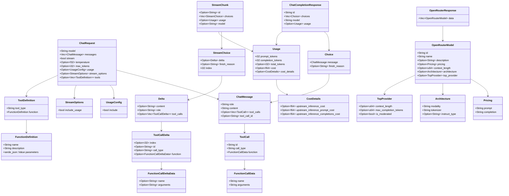
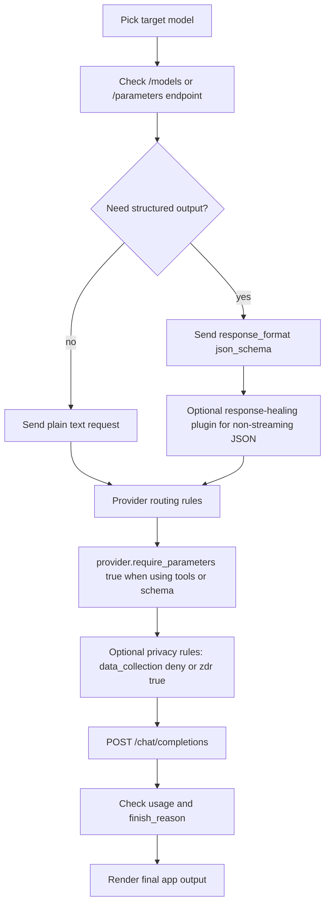

# OpenRouter

This folder contains the Rust data types used to talk to OpenRouter and decode its responses.

Today, this project uses OpenRouter in a simple way:

- build a `ChatRequest`
- send it to `POST /api/v1/chat/completions`
- read a `ChatCompletionResponse`
- take `choices[0].message.content`

The folder already contains more types than the current runtime path needs:

- normal chat request/response
- streaming response
- tool calling
- models API metadata

That is good, but part of the folder is already behind the current OpenRouter docs and should be treated as a partial schema, not a full schema.

This review was made in two layers:

- local code review of every file in this folder
- current official OpenRouter docs review

So this file is not just "what the code does today".
It is also "where the folder matches the real API" and "where it is behind".

## Current runtime files

The files used in the current write path are:

- [chat_message.rs](./chat_message.rs)
- [chat_request.rs](./chat_request.rs)
- [choice.rs](./choice.rs)
- [chat_completion_response.rs](./chat_completion_response.rs)
- [usage.rs](./usage.rs)
- [cost_details.rs](./cost_details.rs)
- [usage_config.rs](./usage_config.rs)

The current request sender is outside this folder:

- [write_news_with_ai.rs](../../writing_news/write_news_with_ai.rs)

## Folder map

This folder is easier to read if we split it into four groups:

- request types
  - [chat_request.rs](./chat_request.rs)
  - [chat_message.rs](./chat_message.rs)
  - [tool_definition.rs](./tool_definition.rs)
  - [function_definition.rs](./function_definition.rs)
  - [usage_config.rs](./usage_config.rs)
  - [stream_options.rs](./stream_options.rs)
- response types
  - [chat_completion_response.rs](./chat_completion_response.rs)
  - [choice.rs](./choice.rs)
  - [usage.rs](./usage.rs)
  - [cost_details.rs](./cost_details.rs)
- streaming and tool call helper types
  - [stream_chunk.rs](./stream_chunk.rs)
  - [stream_choice.rs](./stream_choice.rs)
  - [delta.rs](./delta.rs)
  - [tool_call.rs](./tool_call.rs)
  - [tool_call_delta.rs](./tool_call_delta.rs)
  - [function_call_data.rs](./function_call_data.rs)
  - [function_call_delta_data.rs](./function_call_delta_data.rs)
- models API metadata types
  - [open_router_response.rs](./open_router_response.rs)
  - [open_router_model.rs](./open_router_model.rs)
  - [architecture.rs](./architecture.rs)
  - [pricing.rs](./pricing.rs)
  - [top_provider.rs](./top_provider.rs)

## Class diagram



## Flow diagram

### Current flow in this project

```mermaid
flowchart TD
    A[group_related_news output] --> B[format_group_for_ai]
    B --> C[NewsWriter.write_news_message]
    C --> D[Build ChatRequest]
    D --> E[reqwest POST /api/v1/chat/completions]
    E --> F[OpenRouter routes request to provider]
    F --> G[ChatCompletionResponse]
    G --> H[choices[0].message.content]
    H --> I[Split text in 4096-char parts]
    I --> J[send_to_telegram]
```

### Best flow if we want a stronger OpenRouter integration



## Current request example in this project

This is the real shape the app sends today, simplified:

```json
{
  "model": "x-ai/grok-4.1-fast",
  "messages": [
    {
      "role": "system",
      "content": "<prompt from news_message.yml>"
    },
    {
      "role": "user",
      "content": "<joined news blocks>"
    }
  ],
  "stream": false,
  "temperature": 0.9,
  "max_tokens": 4000,
  "usage": {
    "include": true
  }
}
```

Request headers sent today:

- `Authorization: Bearer ...`
- `Content-Type: application/json`
- `HTTP-Referer: https://compra.ai`
- `X-Title: compra.ai`

Note:

- the official docs currently prefer `X-OpenRouter-Title`
- `X-Title` is still accepted

## File by file review

| File | What it represents | Used now? | Notes |
| --- | --- | --- | --- |
| [architecture.rs](./architecture.rs) | model architecture metadata | No | Partial and likely outdated vs current Models API |
| [chat_completion_response.rs](./chat_completion_response.rs) | non-stream chat response root | Yes | Good for current path, but incomplete vs full API |
| [chat_message.rs](./chat_message.rs) | chat message payload | Yes | Too narrow for current API because `content` is only `String` |
| [chat_request.rs](./chat_request.rs) | request body for chat completions | Yes | Good for basic text calls, missing many useful fields |
| [choice.rs](./choice.rs) | one response choice | Yes | Missing `index` and other optional fields |
| [cost_details.rs](./cost_details.rs) | cost breakdown inside usage | Sometimes | Fine as partial schema |
| [delta.rs](./delta.rs) | streaming delta payload | No | Good starter type for SSE streaming |
| [function_call_data.rs](./function_call_data.rs) | full function call payload | No | Useful if tool calling is added |
| [function_call_delta_data.rs](./function_call_delta_data.rs) | partial function call delta | No | Useful for streamed tool calling |
| [function_definition.rs](./function_definition.rs) | tool schema sent to model | No | Good base shape |
| [open_router_model.rs](./open_router_model.rs) | one model from `/models` | No | Partial and behind current API |
| [open_router_response.rs](./open_router_response.rs) | root response from `/models` | No | Fine as wrapper, but model payload is partial |
| [pricing.rs](./pricing.rs) | model pricing metadata | No | Missing newer fields like request or image pricing |
| [stream_choice.rs](./stream_choice.rs) | one streamed choice | No | Fine as partial schema |
| [stream_chunk.rs](./stream_chunk.rs) | one SSE chunk | No | Fine as partial schema |
| [stream_options.rs](./stream_options.rs) | request options for streaming | No | Present but not used |
| [tool_call.rs](./tool_call.rs) | assistant tool call payload | No | Good base shape |
| [tool_call_delta.rs](./tool_call_delta.rs) | streamed tool call delta | No | Good base shape |
| [tool_definition.rs](./tool_definition.rs) | tool definition sent in request | No | Good base shape |
| [top_provider.rs](./top_provider.rs) | top provider metadata for a model | No | Fine as partial schema |
| [usage.rs](./usage.rs) | prompt/completion usage data | Yes | Good enough for current cost logging |
| [usage_config.rs](./usage_config.rs) | request flag to include usage | Yes | Used today |
| [mod.rs](./mod.rs) | module exports | Yes | Re-exports everything in one place |

## What each file does well today

### Core request and response

- [chat_request.rs](./chat_request.rs) is enough for:
  - model
  - messages
  - temperature
  - max tokens
  - basic usage tracking
- [chat_completion_response.rs](./chat_completion_response.rs) and [choice.rs](./choice.rs) are enough for the current "get final text and stop" path

### Streaming and tools

- The streaming and tool-call files are a good base if we later add:
  - streaming
  - tool calling
  - multi-step agent loops

### Models API

- The model metadata files are enough to start a `/models` client, but they are not complete enough to reflect the current official schema.

## Current gaps compared to the official OpenRouter docs

These are the most important gaps if we want the folder to model the current API well.

### 1. `ChatMessage` is too narrow

Current file:

- [chat_message.rs](./chat_message.rs)

Current problem:

- `content` is only `String`

Official docs:

- user messages can be `string` or content-part arrays
- tool messages use `role: "tool"`
- messages can also include `name`

Why it matters:

- the current struct is enough for text-only chat
- it is not enough for:
  - multimodal inputs
  - clean tool result messages
  - future assistant prefill variants with more structure

### 2. `ChatRequest` is only the small subset

Current file:

- [chat_request.rs](./chat_request.rs)

Missing useful fields from the docs:

- `response_format`
- `provider`
- `plugins`
- `stop`
- `tool_choice`
- `parallel_tool_calls`
- `seed`
- `top_p`
- `top_k`
- `frequency_penalty`
- `presence_penalty`
- `repetition_penalty`
- `min_p`
- `top_a`
- `verbosity`
- `models`
- `route`
- `user`
- `prediction`
- `debug`
- `reasoning`

Why it matters:

- today the request is okay for basic plain-text output
- it is not enough for "best of the best" routing and schema control

### 3. `OpenRouterModel` is behind the current Models API

Current files:

- [open_router_model.rs](./open_router_model.rs)
- [pricing.rs](./pricing.rs)
- [architecture.rs](./architecture.rs)

Current docs now expose more model metadata, such as:

- `canonical_slug`
- `created`
- `supported_parameters`
- `default_parameters`
- `expiration_date`
- richer architecture fields
- richer pricing fields

Why it matters:

- if we want to choose models intelligently, these fields matter
- without them, we cannot properly pre-check whether a model supports:
  - tools
  - structured outputs
  - reasoning
  - stop sequences

### 4. Response types are partial, not complete

Current files:

- [chat_completion_response.rs](./chat_completion_response.rs)
- [choice.rs](./choice.rs)
- [stream_chunk.rs](./stream_chunk.rs)
- [stream_choice.rs](./stream_choice.rs)

Missing or likely useful fields:

- `created`
- `object`
- `system_fingerprint`
- `index`
- `native_finish_reason`
- prompt token details for cache usage
- reasoning details if using reasoning-enabled models
- server-side tool usage fields

Why it matters:

- current types are fine for simple text generation
- they are not enough if we later want:
  - streaming parser
  - cache hit tracking
  - reasoning tracking
  - richer observability

## Best practices from the official OpenRouter docs

These recommendations come from the current OpenRouter docs and are the best fit for this project.

### 1. Keep using direct HTTP with `reqwest`

Why:

- this project is already in Rust
- the current integration is simple and reliable
- we do not need a JS SDK just to send one request

Best extra rule:

- if this folder grows into a full OpenRouter client, use the official OpenAPI spec as the source of truth instead of hand-guessing the full schema

Why:

- the docs publish both `openapi.yaml` and `openapi.json`
- that is safer than manually expanding many request and response structs over time

### 2. Do not hardcode model usage blindly

Current code:

- [write_news_with_ai.rs](../../writing_news/write_news_with_ai.rs) uses `x-ai/grok-4.1-fast`

Best practice:

- keep model IDs configurable in env or YAML
- use `/api/v1/models` and `/api/v1/parameters/:author/:slug` if you depend on special parameters
- query `/api/v1/models?supported_parameters=tools`
- query `/api/v1/models?supported_parameters=response_format`

Why:

- model support changes over time
- supported parameters differ per model

### 3. Use provider routing on purpose

Best practice from docs:

- use `provider.require_parameters = true` when you rely on tools or structured outputs
- use `provider.sort` if you explicitly want throughput, latency, or price behavior
- use `provider.order` only when you truly want to pin providers

Why:

- default OpenRouter routing already balances price and uptime
- manual provider pinning should be deliberate, not random

### 4. Use `response_format` only when the app needs machine-readable output

Best fit for this project:

- current Telegram output is human text, so plain text is okay
- if we later want stronger correctness, ask for structured JSON and render the final Telegram text locally

Best practice from docs:

- use `json_schema`
- set `strict: true`
- include clear field descriptions
- set `provider.require_parameters = true`

### 5. If you use structured output, pair it with response healing for non-streaming

Docs say:

- response healing can repair malformed JSON for non-streaming schema responses

Best fit here:

- useful only if we change the app to expect JSON from the model
- not needed for the current plain-text Telegram post

### 6. Use streaming only if user-facing latency matters

Best fit for this project:

- this is a scheduled feed writer, not an interactive chat UI
- non-streaming is simpler and good enough

### 7. Use privacy routing if needed

Docs support:

- `provider.data_collection = "deny"`
- `provider.zdr = true`

Best fit here:

- if the content being summarized is sensitive, private, or not meant to be retained, add privacy routing
- for public news summarization this is optional, but still a reasonable hardening choice

### 8. Prompt caching is only situationally useful here

Docs say:

- prompt caching helps on repeated prompts and multi-turn conversations

Best fit here:

- this app sends one large prompt per run
- the system prompt is static
- the user/news block changes every run

So:

- caching is not a big win in the current one-shot design
- it becomes more useful only if we split the work into repeated multi-turn calls or large repeated context blocks
- if we ever use it, extend `Usage` with `prompt_tokens_details` so the app can see cache hits and cache writes

### 9. Preserve reasoning details only if you opt into reasoning

The Grok 4.1 Fast model page says reasoning can be enabled or disabled.

Best fit here:

- if you turn reasoning on, the response model types in this folder should be extended to store reasoning fields
- otherwise, keep the simpler shape

## Best way to use OpenRouter in this project

If we want the strongest design without making the app too complex, this is the best next shape:

### Good now

Keep:

- direct HTTP with `reqwest`
- non-streaming request
- one request per assembled news batch

Add:

- configurable model ID
- optional provider preferences
- typed support for model metadata lookups
- use `X-OpenRouter-Title` instead of `X-Title`

### Best next request shape for this project

If we stay with plain text output:

- `model`
- `messages`
- `stream: false`
- `max_tokens`
- `temperature`
- `usage`
- optional `provider.data_collection = "deny"`
- optional `provider.zdr = true`
- explicit `X-OpenRouter-Title` header

Inference from the docs plus this app's use case:

- for RSS/news writing, a lower `temperature` is probably better than `0.9`
- I would test something around `0.2` to `0.5` for more stable tone and fewer weird rewrites

That temperature recommendation is an app decision, not an OpenRouter rule.

If we move to stronger structured generation:

- `response_format` with `json_schema`
- `plugins: [{ id: "response-healing" }]`
- `provider.require_parameters = true`
- local Rust renderer that turns JSON into Telegram markdown or plain text

That second option is more robust than letting the model freestyle the full final post.

## Best request shape I would use here

If the app stays text-first:

```json
{
  "model": "<from env or yml>",
  "messages": [
    { "role": "system", "content": "<system prompt>" },
    { "role": "user", "content": "<news text>" }
  ],
  "stream": false,
  "temperature": 0.3,
  "max_tokens": 2500,
  "usage": { "include": true },
  "provider": {
    "data_collection": "deny"
  }
}
```

Why this shape is better for this app:

- lower temperature gives more stable editorial output
- non-streaming keeps the code simple
- usage is still returned
- privacy routing is a cheap hardening win

If the app becomes stricter and wants safer output:

```json
{
  "model": "<from env or yml>",
  "messages": [
    { "role": "system", "content": "<system prompt>" },
    { "role": "user", "content": "<news text>" }
  ],
  "stream": false,
  "response_format": {
    "type": "json_schema",
    "json_schema": {
      "name": "news_post",
      "strict": true,
      "schema": {
        "type": "object",
        "properties": {
          "title": { "type": "string" },
          "summary": { "type": "string" },
          "items": {
            "type": "array",
            "items": { "type": "string" }
          }
        },
        "required": ["title", "summary", "items"],
        "additionalProperties": false
      }
    }
  },
  "plugins": [{ "id": "response-healing" }],
  "provider": {
    "require_parameters": true,
    "data_collection": "deny"
  },
  "usage": { "include": true }
}
```

That is more work, but it is the better long-term path if the Telegram output format must stay consistent.

## Best next improvements for this folder

If we want this folder to be "best of the best", these are the right code improvements:

### High priority

1. Make `ChatMessage.content` support both:
   - `String`
   - content parts
   - message `name`
   - proper `tool` role support
2. Add a richer `ChatRequest` with:
   - `response_format`
   - `provider`
   - `plugins`
   - `stop`
   - `tool_choice`
   - `parallel_tool_calls`
   - `reasoning`
   - `user`
   - `models`
   - `route`
3. Extend models metadata types with:
   - `supported_parameters`
   - `canonical_slug`
   - `created`
   - `per_request_limits`
   - `default_parameters`
   - `expiration_date`
   - richer `pricing`
   - richer `architecture`

### Medium priority

1. Add response fields:
   - `created`
   - `object`
   - `index`
   - `system_fingerprint`
   - `native_finish_reason`
2. Add typed support for prompt cache usage details
3. Add typed provider routing structs
4. Add `server_tool_use` fields inside `Usage`

### Low priority

1. Add a small client for:
   - `/api/v1/models`
   - `/api/v1/parameters/:author/:slug`
2. Add streaming parser only if the product needs it
3. If this module becomes large, generate the schema layer from the official OpenAPI spec and keep only small hand-written app helpers here

## Sources

Official OpenRouter docs used for this review:

- Quickstart: https://openrouter.ai/docs/
- Chat completions API: https://openrouter.ai/docs/api-reference/chat-completion
- API overview: https://openrouter.ai/docs/api/reference/overview
- Parameters: https://openrouter.ai/docs/api/reference/parameters
- Models overview: https://openrouter.ai/docs/guides/overview/models
- Models API: https://openrouter.ai/docs/api/api-reference/models/get-models
- Model parameters endpoint: https://openrouter.ai/docs/api-reference/parameters/get-parameters
- Provider routing: https://openrouter.ai/docs/provider-routing
- Structured outputs: https://openrouter.ai/docs/features/structured-outputs
- Tool calling: https://openrouter.ai/docs/features/tool-calling
- Plugins: https://openrouter.ai/docs/guides/features/plugins
- Response healing: https://openrouter.ai/docs/guides/features/plugins/response-healing
- Prompt caching: https://openrouter.ai/docs/features/prompt-caching
- Zero data retention: https://openrouter.ai/docs/features/zdr
- Current Grok 4.1 Fast page: https://openrouter.ai/x-ai/grok-4.1-fast
