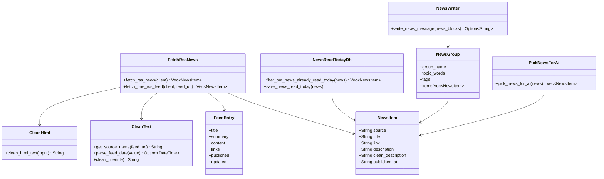
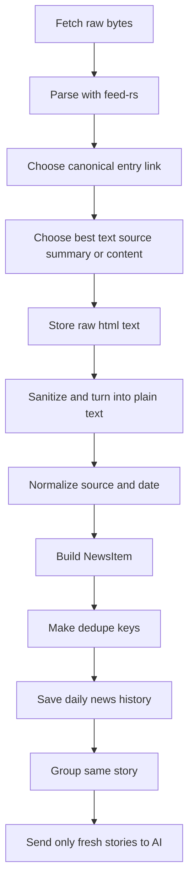

# RSS News

This folder is the smallest data layer for feed items in the app.

It has only one real type today:

- [news_item.rs](./news_item.rs)

That is simple on purpose.
The parser reads many feed formats and many weird feed fields, but the app quickly converts everything into one small struct:

- `source`
- `title`
- `link`
- `description`
- `clean_description`
- `published_at`

This is a good design.
It keeps the rest of the app independent from RSS, Atom, and JSON Feed details.

This review was made in two layers:

- local code review of this folder and the runtime files that build and use `NewsItem`
- current official crate docs review for `feed-rs`, `ammonia`, `html2text`, `chrono`, and `reqwest::Url`

## Current files

- [mod.rs](./mod.rs)
- [news_item.rs](./news_item.rs)

## Folder role in the app

This folder does not fetch feeds by itself.
It defines the normalized shape that the rest of the app uses.

The real builder path is:

- [fetch_rss_news.rs](../../fetching_rss/fetch_rss_news.rs)
- [clean_text.rs](../../formatting_text/clean_text.rs)
- [clean_html.rs](../../formatting_text/clean_html.rs)

After that, `NewsItem` flows through:

- [save_and_check_news_read_today.rs](../../reading_news_today/save_and_check_news_read_today.rs)
- [group_related_news.rs](../../grouping_news/group_related_news.rs)
- [pick_news_for_ai.rs](../../picking_news/pick_news_for_ai.rs)
- [write_news_with_ai.rs](../../writing_news/write_news_with_ai.rs)

## Class diagram



## Flow diagram

### Current flow in this project

```mermaid
flowchart TD
    A[RSS feed URL] --> B[reqwest GET bytes]
    B --> C[feed-rs parser::parse]
    C --> D[feed.entries]
    D --> E[Read title, summary, content, links, published, updated]
    E --> F[get_source_name(feed_url)]
    E --> G[clean_html_text(description)]
    E --> H[date.to_rfc3339]
    F --> I[Build NewsItem]
    G --> I
    H --> I
    I --> J[filter_out_news_already_read_today]
    J --> K[make_all_news_groups]
    K --> L[filter_out_stories_already_read_today]
    L --> M[pick_news_for_ai]
    M --> N[group_related_news]
    N --> O[write_news_with_ai]
    O --> P[send_to_telegram]
```

### Best flow if we want the strongest feed handling



## UML sequence diagram

```mermaid
sequenceDiagram
    participant Loop as main loop
    participant Http as reqwest client
    participant Parser as feed-rs
    participant Html as clean_html_text
    participant Item as NewsItem
    participant NewsDb as NewsReadTodayDb
    participant StoryDb as StoriesReadTodayDb
    participant Group as grouping_news
    participant Pick as pick_news_for_ai
    participant Ai as NewsWriter

    Loop->>Http: GET feed bytes
    Http-->>Loop: bytes
    Loop->>Parser: parse(bytes)
    Parser-->>Loop: Feed with entries
    Loop->>Html: sanitize summary/content
    Html-->>Loop: clean_description
    Loop->>Item: build NewsItem
    Loop->>NewsDb: filter_out_news_already_read_today(news)
    NewsDb-->>Loop: fresh_news
    Loop->>NewsDb: save_news_read_today(fresh_news)
    Loop->>Group: make_all_news_groups(fresh_news)
    Group-->>Loop: story_groups
    Loop->>StoryDb: filter_out_stories_already_read_today(story_groups)
    StoryDb-->>Loop: fresh_story_groups
    Loop->>Pick: pick_news_for_ai(fresh_story_news)
    Pick-->>Loop: picked_news
    Loop->>Group: group_related_news(picked_news)
    Group-->>Loop: final_groups
    Loop->>Ai: write_news_message(final_groups)
    Ai-->>Loop: final_text
```

## File by file review

| File | What it does | Used now? | Notes |
| --- | --- | --- | --- |
| [mod.rs](./mod.rs) | module export for `news_item` | Yes | Small and correct |
| [news_item.rs](./news_item.rs) | normalized feed item used by the whole app | Yes | Good simple contract, but a few fields could be stronger if we want richer metadata |

## What `NewsItem` does well today

### 1. It isolates feed weirdness early

This is the biggest win.

`feed-rs` exposes a big unified model with `Entry`, `Text`, `Content`, `Link`, dates, media, authors, categories, and more.
The app does not spread that complexity everywhere.
It maps one feed entry into one simple struct and moves on.

That keeps:

- grouping code simpler
- dedupe code simpler
- AI input simpler
- debug prints simpler

### 2. It keeps both raw and clean description

`NewsItem` stores both:

- `description`
- `clean_description`

That is a very good choice.

Why:

- `description` preserves the original feed text we received
- `clean_description` is safer and easier to score, group, dedupe, and send to the LLM

If we sanitized too early and only kept the cleaned text, we would lose audit value.

### 3. It stores the date with timezone information

`published_at` is stored as RFC 3339 text in [fetch_rss_news.rs](../../fetching_rss/fetch_rss_news.rs).

That is better than storing only a local date string because the offset is preserved.
That helps with:

- ordering
- filtering by day window
- future debugging
- future cross-timezone logic

### 4. It stays serialization-friendly

Because every field is `String`, `NewsItem` is easy to:

- serialize with Serde
- clone
- log
- store in local keys
- move between modules

That simplicity is useful in a small app.

## Current builder logic

The real `NewsItem` builder lives in [fetch_rss_news.rs](../../fetching_rss/fetch_rss_news.rs).

The mapping is:

- `source`
  - comes from `get_source_name(feed_url)`
- `title`
  - comes from `entry.title.map(|title| title.content).unwrap_or_default()`
- `link`
  - comes from the first entry link where `rel != "self"`
- `description`
  - prefers `entry.summary.content`
  - falls back to `entry.content.body`
- `clean_description`
  - comes from `clean_html_text(&description)`
- `published_at`
  - comes from `entry.published.or(entry.updated)?.to_rfc3339()`

That mapping is pragmatic and mostly good.

## Current gaps and tradeoffs

### 1. `published_at` is easy to move around, but not the strongest runtime type

Current type:

- `String`

Why it is okay:

- easy to serialize
- easy to print
- easy to store in local keys

Why it is not ideal:

- every sort or comparison needs parsing again
- invalid values are possible after construction if some future code mutates it badly

Best stronger shape if we ever want stricter internals:

- keep `published_at: String` for output
- add `published_time: DateTime<FixedOffset>` or `published_timestamp: i64` for runtime work

For this app today, the string is acceptable.
For a bigger system, typed date storage would be better.

### 2. `source` is stable, but coarse

Current logic:

- parse the feed URL
- keep `host_str()`

Example:

- `https://blog.example.com/rss.xml` -> `blog.example.com`

This is good because it is:

- stable
- short
- easy to read

But there are tradeoffs:

- two different feeds on the same host collapse into the same source label
- it ignores feed title and publisher name
- it does not distinguish a host-level blog from a section feed

For this app, that is still a reasonable choice because dedupe and grouping need a stable simple source string.

### 3. `link` selection is good, but not perfect

Current logic:

- use the first link where `rel != "self"`

That avoids obvious self-feed links, which is good.

But a more canonical rule would be:

1. prefer `rel == "alternate"`
2. else prefer first non-`self`
3. else fallback to first link

This matters because some feeds expose multiple links:

- self
- alternate
- enclosure
- media links

The current rule is okay, but there is room to make canonical link picking stronger.

### 4. `description` ignores some richer feed fields

Current rule:

- summary first
- content body second

That is pragmatic and usually enough.

But `feed-rs` also exposes:

- `content.src`
- `media`
- `categories`
- `authors`
- `language`

The app ignores those today.
That is okay for a text-first Telegram bot, but it means `NewsItem` is intentionally not a full feed record.

## Best practices from the official crate docs

These recommendations are the best fit for this app.

### 1. Keep passing raw bytes to `feed-rs`

This is already correct in [fetch_rss_news.rs](../../fetching_rss/fetch_rss_news.rs):

- use `.bytes()`
- pass raw bytes into `parser::parse`

This matches the `feed-rs` docs, which warn that `text()` may decode content before the parser sees the XML encoding declaration.

That can break feeds with non-UTF-8 encodings.

So:

- current code is right
- do not switch this to `.text()` just to make the code look simpler

### 2. Keep normalizing into a small app struct early

This is one of the best design choices in the whole app.

`feed-rs` has a rich unified model, but the docs also make clear that fields are often `Option<T>` because real feeds are messy.
Mapping early into `NewsItem` avoids spreading that mess across the codebase.

This is better than:

- carrying `feed_rs::model::Entry` everywhere
- letting the grouping and scoring code know about Atom/RSS details

### 3. Keep sanitizing HTML after parsing

This is also correct.

Current path:

- parse feed entry
- take `summary` or `content.body`
- sanitize with `ammonia`
- convert to text with `html2text`

That is the right trust boundary.

Why:

- feed content is untrusted input
- `ammonia::clean` uses conservative defaults and strips dangerous content
- `html2text::from_read` then turns the safe HTML into plain text

This is better for this app than sending raw HTML into grouping, scoring, or the LLM.

### 4. Do not rely only on feed parser sanitization

`feed-rs` has a parser builder with `sanitize_content(true)`.
That exists, but I would not switch to that here as the only sanitization step.

Why:

- this app wants both raw and clean text
- the current explicit sanitization path is easier to reason about
- `clean_description` is part of the app contract, not only parser behavior

So the current explicit `clean_html_text` step is the better design for this project.

### 5. Keep using timezone-aware date parsing

This app uses `parse_from_rfc3339` first and falls back to `parse_from_rfc2822` in [clean_text.rs](../../formatting_text/clean_text.rs).

That is a good fit because RSS/Atom feeds often use these two formats.
Chrono keeps timezone information in `FixedOffset`, which is the right safe shape for parsed feed dates.

### 6. Use local day filtering only as an app rule, not a truth rule

Current code converts feed dates to `Local` and filters by local day window.

That is fine because the app has a local editorial schedule.
But this is an app policy, not an absolute truth about when a story happened.

That distinction matters when debugging edge cases around midnight or timezones.

## Best of the best way to use this folder

If we want the strongest design without making the app too heavy, this is the best path.

### Keep as is

Keep:

- one small `NewsItem` struct
- raw `description`
- cleaned `clean_description`
- `published_at` with full RFC 3339 output
- explicit HTML sanitization after parsing

### Improve next

The best next improvements would be:

1. Add `feed_url` or `source_feed`
   - helps debugging when the same host has more than one feed
2. Add stronger link picking
   - prefer `rel == "alternate"`
3. Add `published_timestamp`
   - avoids reparsing on every sort
4. Add optional `author` or `tags` only if the scoring/grouping logic really needs them
5. Add `clean_title`
   - only if repeated title normalization becomes a hotspot

### What I would not do now

I would not turn `NewsItem` into a giant feed schema.

That would make the code worse.

For this app, `NewsItem` should stay:

- small
- boring
- stable
- easy to move across modules

## Best request-to-item mapping for this app

If I were describing the ideal mapping rule, it would be this:

```text
1. fetch raw bytes
2. parse feed with feed-rs
3. for each entry:
   - title = entry.title.content or ""
   - published time = entry.published else entry.updated
   - canonical link = alternate else first non-self else first
   - raw description = summary else content.body else ""
   - clean description = ammonia + html2text + trim lines
   - source = normalized host from feed url
4. build NewsItem
5. dedupe by link/title/date/source
6. group by story
7. send only fresh story groups to AI
```

That is already very close to what the code does now.

## Compare with similar crates and approaches

### `feed-rs` vs `rss`

`feed-rs` is the better fit here.

Why:

- supports Atom, RSS, and JSON Feed in one parser
- provides one normalized model
- docs say it is lenient because real-world feeds are messy
- uses `quick-xml` and avoids extra copies where possible

The old `rss` crate is narrower and does not fit the current "many feed formats, one app model" shape as well.

### `feed-rs` vs `feedparser-rs`

`feedparser-rs` is an interesting future alternative.
Its docs claim:

- high performance
- tolerant parsing
- HTTP support
- extension support
- `200+ MB/s` throughput

But for this app today, `feed-rs` is still a very reasonable choice because:

- the current code is already built around its unified model
- parsing is probably not the main bottleneck compared with HTTP and LLM time
- the app only needs a small normalized item shape after parsing

So:

- keep `feed-rs` now
- only benchmark `feedparser-rs` if feed parsing becomes a real hotspot

### `ammonia` vs skipping sanitization

Skipping sanitization would be a mistake.

Feed HTML is untrusted.
The `ammonia` docs explicitly frame the crate as protection against untrusted HTML problems like XSS and layout-breaking content.

Even though this app does not render a browser page, sanitizing before scoring, grouping, and sending to the LLM is still the safer choice.

### `ammonia` + `html2text` vs only one of them

The current combo is good:

- `ammonia` makes HTML safe
- `html2text` turns safe HTML into readable plain text

Using only `html2text` would solve formatting but not the trust boundary as clearly.
Using only `ammonia` would leave HTML markup in the text.

## File by file recommendations

### [news_item.rs](./news_item.rs)

Good today:

- very small
- clear field names
- easy to serialize

Best next improvements:

- maybe add `published_timestamp: i64`
- maybe add `source_feed: String`
- only add more metadata if a real downstream module needs it

### [mod.rs](./mod.rs)

Good today:

- does exactly what it should
- no extra logic

No change needed.

## Sources

Primary sources used for this review:

- `feed-rs` crate docs: https://docs.rs/feed-rs
- `feed-rs` parser docs: https://docs.rs/feed-rs/latest/feed_rs/parser/struct.Parser.html
- `feed-rs` feed model docs: https://docs.rs/feed-rs/latest/feed_rs/model/struct.Feed.html
- `feed-rs` entry docs: https://docs.rs/feed-rs/latest/feed_rs/model/struct.Entry.html
- `feed-rs` text docs: https://docs.rs/feed-rs/latest/feed_rs/model/struct.Text.html
- `feed-rs` content docs: https://docs.rs/feed-rs/latest/feed_rs/model/struct.Content.html
- `feed-rs` link docs: https://docs.rs/feed-rs/latest/feed_rs/model/struct.Link.html
- `ammonia` crate docs: https://docs.rs/ammonia/latest/ammonia/
- `ammonia::clean` docs: https://docs.rs/ammonia/latest/ammonia/fn.clean.html
- `ammonia` README: https://github.com/rust-ammonia/ammonia
- `html2text` crate docs: https://docs.rs/html2text/latest/html2text/
- `html2text::from_read` docs: https://docs.rs/html2text/latest/html2text/fn.from_read.html
- `chrono::DateTime` docs: https://docs.rs/chrono/latest/chrono/struct.DateTime.html
- `chrono` crate docs: https://docs.rs/chrono/latest/chrono/
- `reqwest::Url` docs: https://docs.rs/reqwest/latest/reqwest/struct.Url.html
- `feedparser-rs` crate docs: https://docs.rs/feedparser-rs/latest

## Final verdict

This folder is small, and that is a strength.

The best thing about `rss_news` is not complexity.
It is the decision to convert messy feeds into one boring struct very early.

That is the right design for this app.

If we keep improving it, the right direction is:

- better canonical link picking
- slightly stronger date storage
- optional debug metadata

The wrong direction would be:

- turning `NewsItem` into a giant mirror of every possible feed field

For this project, simple is better here.
