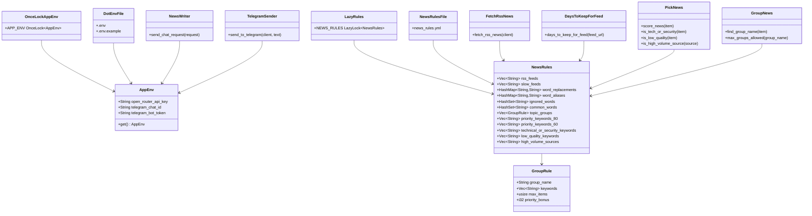
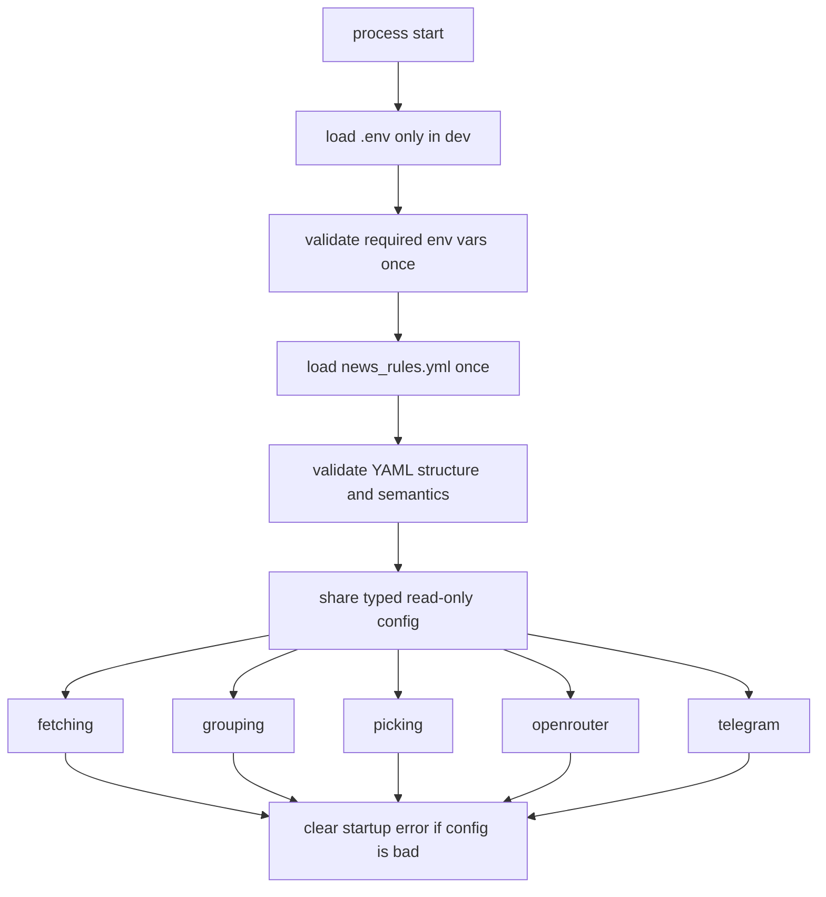
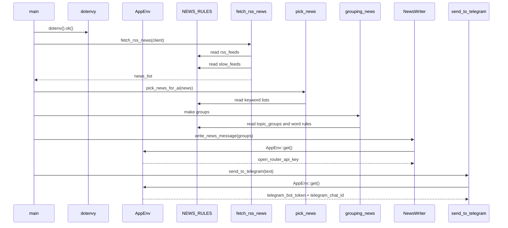

# Settings

This folder is the configuration center of the app.

It has two jobs:

- load secret runtime config from environment variables
- load editorial and filtering rules from YAML

Today, the code splits those jobs like this:

- [app_env.rs](./app_env.rs)
  - runtime secrets and IDs
  - `AppEnv`
  - `APP_ENV`
  - `NEWS_RULES`
- [news_rules.rs](./news_rules.rs)
  - typed YAML schema for `news_rules.yml`
- [mod.rs](./mod.rs)
  - module export

This is a good split.
It keeps deploy-specific secrets separate from versioned app rules.

This review was made in two layers:

- local code review of each file in this folder and the runtime files that use it
- current official docs review for `std::sync::OnceLock`, `std::sync::LazyLock`, `dotenvy`, `serde_norway`, and the Twelve-Factor config rule

## Current files

- [mod.rs](./mod.rs)
- [app_env.rs](./app_env.rs)
- [news_rules.rs](./news_rules.rs)

Important related files outside this folder:

- [news_rules.yml](../../prompts/news_rules.yml)
- [news_message.yml](../../prompts/news_message.yml)
- [.env.example](/Users/enriquesouza/projects/personal/rss-feed/.env.example:1)

## Folder role in the app

This folder does not fetch news, group stories, call the LLM, or send Telegram messages.
It supplies the values that let those modules behave.

There are two config channels:

- environment variables
  - `OPEN_ROUTER_API_KEY`
  - `TELEGRAM_BOT_TOKEN`
  - `TELEGRAM_CHAT_ID`
- YAML editorial rules
  - RSS feed list
  - slow feed list
  - keyword lists
  - word normalization rules
  - topic group rules

## Class diagram



## Flow diagram

### Current flow in this project

```mermaid
flowchart TD
    A[main] --> B[dotenvy::dotenv]
    B --> C[reqwest client setup]
    C --> D[fetch_rss_news]
    D --> E[NEWS_RULES.rss_feeds]
    D --> F[days_to_keep_for_feed]
    F --> G[NEWS_RULES.slow_feeds]
    D --> H[NewsItem list]
    H --> I[pick_news and group_news logic]
    I --> J[NEWS_RULES keyword lists and topic groups]
    J --> K[write_news_with_ai]
    K --> L[AppEnv::get().open_router_api_key]
    K --> M[OpenRouter request]
    M --> N[send_to_telegram]
    N --> O[AppEnv::get().telegram_*]
```

### Best flow if we want the strongest config design



## UML sequence diagram



## File by file review

| File | What it does | Used now? | Notes |
| --- | --- | --- | --- |
| [mod.rs](./mod.rs) | exports the settings submodules | Yes | Small and correct |
| [app_env.rs](./app_env.rs) | loads env vars and YAML statics | Yes | Good idea, but it mixes two different config worlds in one file |
| [news_rules.rs](./news_rules.rs) | typed schema for `news_rules.yml` | Yes | Good data model, but it is permissive and could validate more |

## What each file does well today

### [app_env.rs](./app_env.rs)

Good today:

- uses `OnceLock<AppEnv>` for one-time runtime env loading
- uses `LazyLock<NewsRules>` for one-time YAML loading
- keeps consumers simple through `AppEnv::get()` and `NEWS_RULES`

That makes the rest of the app easy to read.
Callers do not need to pass config everywhere.

### [news_rules.rs](./news_rules.rs)

Good today:

- uses plain Serde derive
- has simple field names in Rust
- uses `#[serde(rename = ...)]` only where the YAML name differs
- models `topic_groups` as a separate `GroupRule` struct

That is the right level of abstraction for this app.

### [mod.rs](./mod.rs)

Good today:

- does exactly one job
- no extra logic

No issue here.

## Real config data used by this folder

### 1. Environment variables

Current env vars expected by [app_env.rs](./app_env.rs):

- `OPEN_ROUTER_API_KEY`
- `TELEGRAM_BOT_TOKEN`
- `TELEGRAM_CHAT_ID`

Current problem:

- [.env.example](/Users/enriquesouza/projects/personal/rss-feed/.env.example:1) only contains:
  - `TELEGRAM_BOT_TOKEN`
  - `TELEGRAM_CHAT_ID`

It is missing:

- `OPEN_ROUTER_API_KEY`

That is a real setup gap.
The code requires it, but the example file does not document it.

### 2. `news_rules.yml`

Current YAML file:

- [news_rules.yml](../../prompts/news_rules.yml)

This file controls:

- which feeds are fetched
- which feeds are treated as slow
- word normalization
- ignored/common words
- topic group naming
- topic group max count
- priority scoring
- technical/security detection
- low-quality filtering
- high-volume source penalty

This is not secret config.
It is versioned editorial logic.

That distinction is important.

## Current runtime usage map

### `AppEnv`

`AppEnv` is used in:

- [write_news_with_ai.rs](../../writing_news/write_news_with_ai.rs)
  - `open_router_api_key`
- [send_to_telegram.rs](../../sending_to_telegram/send_to_telegram.rs)
  - `telegram_bot_token`
  - `telegram_chat_id`

### `NEWS_RULES`

`NEWS_RULES` is used in:

- [fetch_rss_news.rs](../../fetching_rss/fetch_rss_news.rs)
  - `rss_feeds`
- [days_to_keep_for_feed.rs](../../fetching_rss/days_to_keep_for_feed.rs)
  - `slow_feeds`
- [find_group_name.rs](../../grouping_news/find_group_name.rs)
  - `topic_groups`
- [find_topic_words.rs](../../grouping_news/find_topic_words.rs)
  - `word_replacements`
  - `word_aliases`
  - `ignored_words`
  - `common_words`
- [score_news_group.rs](../../grouping_news/score_news_group.rs)
  - `topic_groups.priority_bonus`
- [check_source_type.rs](../../picking_news/check_source_type.rs)
  - `high_volume_sources`
- [check_news.rs](../../picking_news/check_news.rs)
  - `technical_or_security_keywords`
  - `low_quality_keywords`
- [score_news.rs](../../picking_news/score_news.rs)
  - `technical_or_security_keywords`
  - `priority_keywords_80`
  - `priority_keywords_60`
  - `low_quality_keywords`
  - `high_volume_sources`

That means this folder drives almost all editorial behavior in the app.

## Current gaps and tradeoffs

### 1. `app_env.rs` mixes secrets and rule loading

Today, [app_env.rs](./app_env.rs) contains both:

- `APP_ENV`
- `NEWS_RULES`

That works, but the file name is narrower than the real job.
It is not just env.
It is env plus rule loading.

For readability, the stronger split would be:

- `app_env.rs`
  - only `AppEnv`
  - only `APP_ENV`
- `news_rules_loader.rs`
  - only `NEWS_RULES`

I would not call this a bug.
It is a clarity issue.

### 2. `AppEnv::get()` is hard-fail config loading

Current code:

- uses `std::env::var(...).expect(...)`

That is acceptable for a small CLI/daemon app.
Fail fast is often good.

But the downside is:

- the app can panic at first use instead of failing with one startup validation pass
- the error is clear, but fragmented across first access points

Best stronger shape:

- validate all required env vars once at startup
- return a typed error instead of panicking

### 3. `NEWS_RULES` uses `LazyLock` with panic-on-load

Current code:

- reads YAML with `read_to_string`
- parses with `serde_norway::from_str`
- panics on read or parse failure

This is the most important technical tradeoff in the folder.

Why:

- `LazyLock` is convenient
- but the std docs say that if the initialization closure panics, the `LazyLock` becomes poisoned
- and that poisoning is unrecoverable for future accesses

That means one bad YAML read or parse can poison the static for the whole process lifetime.

For a single-process app that should die fast on bad config, this is survivable.
But it is not the strongest design.

Best stronger shape:

- load and validate `news_rules.yml` during startup
- store the parsed value in `OnceLock<NewsRules>` after success
- or keep `LazyLock`, but only if the closure cannot panic and instead wraps a `Result`

### 4. `NewsRules` validates structure, but not semantics

Serde ensures the YAML shape is compatible with the struct.
That is good.

But semantic validation is still missing.

Examples:

- duplicate RSS feed URLs
- duplicate topic group IDs
- empty keyword lists where they should not be empty
- negative or silly score policy
- typo-only aliases
- empty strings inside lists

Today, those problems would deserialize fine and only show up later as weird app behavior.

### 5. `news_rules.yml` is an editorial engine, not just settings

This is important.

`news_rules.yml` currently acts like:

- feed registry
- grouping policy
- ranking policy
- quality filter policy
- source penalty policy
- vocabulary normalization policy

That is powerful, but it also means one file now carries many responsibilities.

That is okay for a small project.
For a larger one, I would eventually split it into:

- `feeds.yml`
- `group_rules.yml`
- `score_rules.yml`
- `word_rules.yml`

Not needed right now, but worth noting.

## Best practices from the official docs

These are the best-fit recommendations for this project.

### 1. Secrets in env, app policy in versioned files

The Twelve-Factor config rule says deploy-specific config should live in environment variables.

That matches:

- API keys
- bot tokens
- chat IDs

It does not force internal app policy into env vars.

So the current split is good:

- secrets in env
- editorial rules in YAML tracked by git

That is one of the best design decisions in this folder.

### 2. `dotenvy` is for dev convenience, not the main config system

The `dotenvy` docs describe it as convenient for development and say `dotenv()` loads `.env` from the current directory or parents.

That matches current usage in [main.rs](/Users/enriquesouza/projects/personal/rss-feed/src/main.rs:26):

```rust
dotenv().ok();
```

This is fine.
The app still fundamentally uses real environment variables.
`.env` is only a local convenience layer.

### 3. `OnceLock` is a good fit for `AppEnv`

The std docs say:

- `OnceLock` can be used in statics
- `get_or_init` initializes once
- many threads may call it concurrently, but only one initializer runs if it does not panic
- unlike `Mutex`, `OnceLock` is never poisoned on panic

That makes `OnceLock<AppEnv>` a strong choice here.

Why:

- env vars should not change during runtime
- the value is read-only after init
- access is cheap and simple

### 4. `LazyLock` is convenient, but poisoning matters

The std docs say:

- `LazyLock` initializes on first access
- if the init closure panics, the lock becomes poisoned
- future accesses panic too

So `LazyLock<NewsRules>` is convenient, but not the safest choice if YAML load failure should produce a normal startup error.

### 5. Typed deserialization is the right shape

The `serde_norway` docs show the intended use:

- derive `Deserialize`
- call `from_str`

That is exactly what [news_rules.rs](./news_rules.rs) and [app_env.rs](./app_env.rs) do.

This is better than:

- manually walking YAML values
- using stringly typed lookups everywhere

### 6. Prefer clear startup validation for config-heavy apps

This point is partly from the docs above and partly from engineering judgment.

Inference:

- when config fans out into many modules, the best user experience is usually:
  - load once
  - validate once
  - fail once with a clean error

Instead of:

- lazily panic later from first use site

## Best of the best way to use this folder

If we want the strongest design without overengineering, this is the best path.

### Keep as is

Keep:

- env secrets in `AppEnv`
- editorial YAML in `NewsRules`
- typed structs with Serde derive
- global read-only access pattern

Those are good choices for this project.

### Improve next

The best next improvements would be:

1. Add startup validation function
   - validate env vars
   - validate YAML structure
   - validate YAML semantics
2. Split `NEWS_RULES` loader out of `app_env.rs`
   - makes the code easier to read
3. Add `OPEN_ROUTER_API_KEY` to [.env.example](/Users/enriquesouza/projects/personal/rss-feed/.env.example:1)
4. Add semantic checks like:
   - no duplicate feeds
   - no duplicate topic group names
   - no empty keywords in lists
5. Consider a `Settings` facade only if the config layer grows more

### What I would not do now

I would not move all editorial rules into env vars.

That would be worse.

Large lists like:

- feed URLs
- aliases
- ignored words
- topic groups

belong in a versioned file, not in many env vars.

I also would not bring in a heavy config framework yet.
The current app is small enough that:

- `dotenvy`
- `OnceLock`
- `LazyLock`
- `serde_norway`

are enough.

## Best startup shape for this app

If I were describing the ideal config flow, it would be this:

```text
1. load .env for local development
2. read required env vars:
   - OPEN_ROUTER_API_KEY
   - TELEGRAM_BOT_TOKEN
   - TELEGRAM_CHAT_ID
3. read src/prompts/news_rules.yml
4. deserialize into NewsRules
5. validate:
   - feeds not empty
   - no duplicate feeds
   - topic group ids unique
   - required lists not empty
6. freeze settings into global read-only statics
7. start fetch loop
```

That is stronger than the current lazy panic path, but still simple.

## Compare with similar approaches

### Current approach vs `config` crate style

The `config` ecosystem is useful when you need:

- layered files
- env overrides
- profile-specific config
- many config sources

This app does not need that yet.

The current hand-written typed approach is better because it is:

- smaller
- easier to read
- easier to debug
- harder to misuse

### `OnceLock` vs passing config everywhere

Passing config explicitly can be cleaner in large systems.
But for this app, the global read-only static approach is fine because:

- config is process-wide
- values are immutable after init
- there is no per-request config variation

So `OnceLock` and `LazyLock` are acceptable here.

### YAML vs hardcoded Rust constants

YAML is better here because the editorial rules are large and change often.

Putting all of this into Rust constants would make updates slower and noisier:

- feed list
- ignored words
- topic groups
- keyword weights

These are content rules, not core program logic.

### YAML vs env vars

Env vars are right for secrets and deploy-specific values.
YAML is right for large structured editorial rules.

The current split is correct.

## File by file recommendations

### [app_env.rs](./app_env.rs)

Good today:

- simple
- low code
- correct use of `OnceLock`

Best next improvements:

- move `NEWS_RULES` to a separate loader file
- expose a startup `validate_settings()` path
- avoid unrecoverable `LazyLock` poisoning by not panicking inside the lazy initializer

### [news_rules.rs](./news_rules.rs)

Good today:

- good struct split
- naming is understandable
- maps the YAML well

Best next improvements:

- add a semantic validation method, for example `check_rules()`
- maybe add `#[serde(deny_unknown_fields)]` if you want the YAML to fail on unknown keys

That last point is an inference from Serde practice, not a crate requirement.

### [mod.rs](./mod.rs)

Good today:

- exactly enough

No change needed.

## Sources

Primary sources used for this review:

- `OnceLock` docs: https://doc.rust-lang.org/std/sync/struct.OnceLock.html
- `LazyLock` docs: https://doc.rust-lang.org/std/sync/struct.LazyLock.html
- `dotenvy` crate docs: https://docs.rs/dotenvy/latest/dotenvy/
- `dotenvy::dotenv` docs: https://docs.rs/dotenvy/latest/dotenvy/fn.dotenv.html
- `serde_norway` crate docs: https://docs.rs/serde_norway/latest/serde_norway/
- Twelve-Factor config rule: https://12factor.net/config

## Final verdict

The core design of `settings` is good.

The best thing here is the split between:

- secrets in env
- editorial policy in YAML

That is the correct direction.

The biggest weakness is not architecture.
It is failure mode:

- `AppEnv` and `NEWS_RULES` currently hard-fail through panic paths
- `NEWS_RULES` specifically uses `LazyLock`, whose panic poisoning is unrecoverable

So if we want the strongest version of this folder, the next move is not a new crate.
It is:

- cleaner startup validation
- clearer separation of loader responsibilities
- better setup docs in `.env.example`
