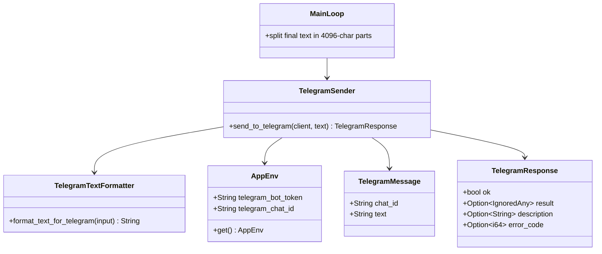
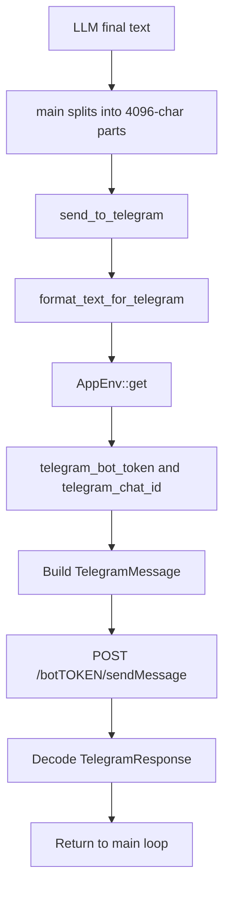
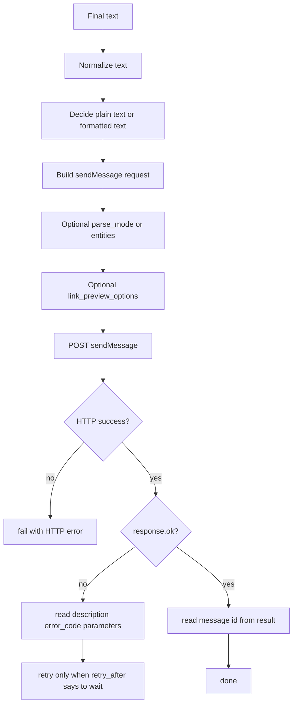
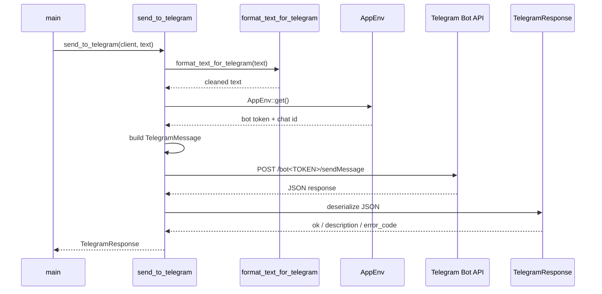

# Telegram

This folder is the Telegram data layer of the app.

Today it is intentionally small.
It only models the minimum needed to send plain text messages through the Telegram Bot API:

- [telegram_message.rs](./telegram_message.rs)
- [telegram_response.rs](./telegram_response.rs)

That small scope is good.
But the current code is also narrower than the real Bot API, so this folder should be read as:

- enough for the current app
- not a full Telegram Bot API schema

This review was made in two layers:

- local code review of each file in `src/app_data/telegram` and the real sender path in `src/sending_to_telegram`
- current official Telegram Bot API docs review

## Current files

- [mod.rs](./mod.rs)
- [telegram_message.rs](./telegram_message.rs)
- [telegram_response.rs](./telegram_response.rs)

Important related runtime files:

- [send_to_telegram.rs](../../sending_to_telegram/send_to_telegram.rs)
- [format_text_for_telegram.rs](../../sending_to_telegram/format_text_for_telegram.rs)
- [main.rs](/Users/enriquesouza/projects/personal/rss-feed/src/main.rs:1)
- [app_env.rs](../settings/app_env.rs)

## Folder role in the app

This folder does not decide:

- when to send
- what to send
- how to split the final output

It only gives the sender code the request and response shapes.

The real send path is:

1. `main.rs` gets the final text from the LLM
2. `main.rs` splits it into 4096-char chunks
3. `send_to_telegram.rs` normalizes line breaks
4. `send_to_telegram.rs` builds `TelegramMessage`
5. `reqwest` sends `POST https://api.telegram.org/bot<token>/sendMessage`
6. JSON is decoded into `TelegramResponse`

## Class diagram



## Flow diagram

### Current flow in this project



### Best flow if we want a stronger Telegram integration



## UML sequence diagram



## File by file review

| File | What it does | Used now? | Notes |
| --- | --- | --- | --- |
| [mod.rs](./mod.rs) | exports Telegram types | Yes | Small and correct |
| [telegram_message.rs](./telegram_message.rs) | request body for `sendMessage` | Yes | Very small, but narrower than the real API |
| [telegram_response.rs](./telegram_response.rs) | minimal Bot API response shape | Yes | Good enough to know success/failure, but hides useful fields |

## What each file does well today

### [telegram_message.rs](./telegram_message.rs)

Good today:

- simple request body
- matches the current use case
- `chat_id` and `text` are the only required fields for the current sender

That is enough for:

- plain text send
- one destination chat
- no formatting
- no reply markup

### [telegram_response.rs](./telegram_response.rs)

Good today:

- captures the most important Bot API fields:
  - `ok`
  - `description`
  - `error_code`
- ignores the big `result` payload, which keeps the code small

That is acceptable for a fire-and-forget sender.

### [mod.rs](./mod.rs)

Good today:

- exactly enough
- no extra logic

No issue here.

## Current request shape in this app

Today, the sender builds this simplified JSON body:

```json
{
  "chat_id": "<TELEGRAM_CHAT_ID>",
  "text": "<normalized text>"
}
```

The transport uses:

- `POST`
- JSON body
- `https://api.telegram.org/bot<TOKEN>/sendMessage`

That matches the official Bot API docs.
Telegram says Bot API methods accept JSON, and `sendMessage` returns a sent `Message` object on success.

## Current runtime behavior

Today, the send flow in [send_to_telegram.rs](../../sending_to_telegram/send_to_telegram.rs) is:

1. skip empty input
2. normalize line breaks with `format_text_for_telegram`
3. load `telegram_chat_id` and `telegram_bot_token`
4. send JSON to `sendMessage`
5. deserialize to `TelegramResponse`

And [main.rs](/Users/enriquesouza/projects/personal/rss-feed/src/main.rs:85) splits the final output into chunks of `4096` chars before calling the sender.

That chunk size comes from the Telegram Bot API docs:

- `sendMessage.text` must be `1-4096 characters after entities parsing`

So the current chunk size is directionally correct.

## Current gaps and tradeoffs

### 1. `TelegramMessage` is only the tiny subset

Current fields:

- `chat_id`
- `text`

Important official `sendMessage` fields currently missing:

- `parse_mode`
- `entities`
- `link_preview_options`
- `disable_notification`
- `protect_content`
- `reply_parameters`
- `reply_markup`
- `message_thread_id`

That is not a bug.
It only means this struct is a minimal app-specific shape, not a general Telegram sender model.

### 2. `TelegramResponse` hides useful error recovery data

Current fields:

- `ok`
- `result`
- `description`
- `error_code`

Telegram docs also say some failed responses may include:

- `parameters`

And that object may contain:

- `retry_after`
- `migrate_to_chat_id`

Why this matters:

- `retry_after` is the clean way to handle flood control
- `migrate_to_chat_id` helps recover when a group migrates to a supergroup

The current model ignores that completely.

### 3. The sender does not check `response.ok`

Current code:

- sends request
- deserializes JSON
- returns `TelegramResponse`

But it does not reject:

- Bot API responses with `ok: false`

That means a Telegram application-level failure can look like a “successful Rust request”.

That is the biggest weakness in the current runtime path.

### 4. The sender does not check HTTP status before parsing

Current code does not explicitly check `http_response.status()`.

That is usually okay if Telegram still returns JSON for errors, but it is weaker than:

- reject non-2xx transport errors
- then inspect `ok`
- then inspect `parameters`

### 5. `result` is thrown away too aggressively

Today:

- `result: Option<IgnoredAny>`

That keeps the type tiny, but we lose:

- sent `message_id`
- exact returned message metadata
- any later possibility of edit/delete/reply chaining

If the app ever wants:

- dedupe by sent message id
- edits
- reply threading

this response type will be too small.

### 6. `format_text_for_telegram` is plain-text cleanup, not Telegram escaping

This is an important distinction.

[format_text_for_telegram.rs](../../sending_to_telegram/format_text_for_telegram.rs) currently:

- normalizes line breaks
- turns `<br>` variants into newlines
- removes empty lines inside paragraphs

That is useful.
But it is not:

- MarkdownV2 escaping
- HTML entity escaping
- Telegram entity building

So this formatter is only safe because the sender currently uses plain text without `parse_mode`.

### 7. Chunking is correct for plain text, but would need care if formatting is added

Telegram says the limit is:

- `1-4096 characters after entities parsing`

That means the current split is okay for plain text.

But if the app later uses:

- `parse_mode = MarkdownV2`
- `parse_mode = HTML`
- raw `entities`

then chunking logic must be revisited.

That is because escape sequences and entity parsing change what Telegram counts.

## Best practices from the official Telegram docs

These are the best-fit recommendations for this app.

### 1. Keep using JSON `POST` requests

Telegram docs explicitly say Bot API methods accept:

- query string
- form-urlencoded
- JSON
- multipart for file upload

For this app, JSON is the right choice.

Why:

- only text messages are sent
- `reqwest` JSON body is simple
- no file upload is needed

### 2. Keep plain text unless rich formatting is truly needed

Telegram supports:

- plain text
- `parse_mode`
- explicit `entities`

For this app today, plain text is the safest option.

Why:

- no escaping issues
- no broken MarkdownV2 formatting
- no HTML entity bugs
- chunking remains simple

Inference:

- for an automated news bot, plain text is often the most stable default

### 3. If formatting is added, prefer HTML over MarkdownV2

This is my engineering inference from the official docs, not a Telegram rule.

Why I would prefer HTML here:

- Telegram says legacy `Markdown` is backward-compat only
- Telegram's `MarkdownV2` has many escaping rules
- HTML has fewer “surprise escape every symbol” problems for generated text

The docs show `MarkdownV2` requires escaping many characters like:

- `_`
- `*`
- `[`
- `]`
- `(`
- `)`
- `~`
- `` ` ``
- `>`
- `#`
- `+`
- `-`
- `=`
- `|`
- `{`
- `}`
- `.`
- `!`

For LLM-generated text, that is fragile.

So if formatting is added later, I would choose:

- `parse_mode = "HTML"`

and explicitly escape unsupported text.

### 4. Check both transport success and Bot API success

Official docs say:

- response JSON always has `ok`
- failed responses may include `description`
- failed responses may include `error_code`
- some errors may include `parameters`

So the stronger runtime rule is:

1. check HTTP status
2. parse JSON
3. require `ok == true`
4. inspect `parameters.retry_after` for flood control
5. inspect `parameters.migrate_to_chat_id` for migrated chats

### 5. Model `ResponseParameters`

Telegram documents a real recovery object:

- `retry_after`
- `migrate_to_chat_id`

That means the best next response model is not bigger `result`.
It is first:

- typed error recovery data

That is more useful than dozens of unused success fields.

### 6. Prefer `link_preview_options` over old preview-style flags

The modern `sendMessage` docs use:

- `link_preview_options`

That is the current way to control preview behavior.

Inference:

- if this bot later sends inline links, use `link_preview_options`
- do not design around older “single boolean preview flag” assumptions

### 7. Keep the 4096-character rule explicit in the app

Telegram documents `1-4096 characters after entities parsing`.

The app already chunks at `4096`.
That rule should stay visible and intentional.

## Best of the best way to use this folder

If we want the strongest design without making it bloated, this is the best path.

### Keep as is

Keep:

- one small request struct
- one small response struct
- plain text sending
- dedicated formatter for whitespace cleanup

That is the right default for this project.

### Improve next

The best next improvements would be:

1. Add transport and Bot API error checks
2. Add typed `ResponseParameters`
3. Return a typed sent message summary instead of ignoring `result`
4. Add optional `parse_mode` only if the bot really needs formatting
5. Add optional `link_preview_options` only if the bot starts sending inline links

### What I would not do now

I would not mirror the entire Telegram `Message` schema.

That would be overkill.

The Bot API is huge.
This app only needs a tiny slice of it.

I also would not switch to MarkdownV2 for generated news posts unless there is a strong product reason.

## Best request shape for this app

For the current app, the best request shape is still:

```json
{
  "chat_id": "<chat id>",
  "text": "<plain text news chunk>"
}
```

That is the most stable version.

If the app later wants richer presentation, the best stronger shape is:

```json
{
  "chat_id": "<chat id>",
  "text": "<escaped html text>",
  "parse_mode": "HTML",
  "link_preview_options": {
    "is_disabled": true
  },
  "disable_notification": false,
  "protect_content": false
}
```

That recommendation is partly inference, but it fits this project well:

- generated text is easier to manage with HTML than MarkdownV2
- previews are often noise for a news digest that already contains enough text

## Compare with similar approaches

### Current minimal structs vs full Telegram SDK-style model

A full Telegram SDK or full schema mirror is useful when you need:

- buttons
- callbacks
- replies
- edits
- media
- webhooks
- update handling

This app does not.

So the current small-model approach is better because it is:

- easier to read
- easier to change
- lower maintenance

### Plain text vs `parse_mode`

Plain text:

- strongest stability
- least formatting risk
- easiest chunking

`parse_mode`:

- prettier
- but easier to break

For this app, plain text wins today.

### Ignoring `result` vs storing a small sent-message struct

Ignoring `result` is okay if all you want is “best effort send”.

But the stronger middle ground is:

- do not model full Telegram `Message`
- do model a tiny `SentTelegramMessage` with:
  - `message_id`
  - maybe `date`
  - maybe `chat.id`

That would be a better tradeoff if the sender ever needs follow-up actions.

## File by file recommendations

### [telegram_message.rs](./telegram_message.rs)

Good today:

- tiny
- clear
- enough for current use

Best next improvements:

- add optional:
  - `parse_mode`
  - `link_preview_options`
  - `disable_notification`
  - `protect_content`

Only when needed.

### [telegram_response.rs](./telegram_response.rs)

Good today:

- enough to see success and error description

Best next improvements:

- add optional `parameters`
- replace `IgnoredAny` result with a tiny typed success struct if the app ever needs message ids

### [mod.rs](./mod.rs)

Good today:

- exactly enough

No change needed.

## Sources

Primary official sources used for this review:

- Telegram Bot API overview: https://core.telegram.org/bots/api
- `sendMessage` docs: https://core.telegram.org/bots/api#sendmessage
- Formatting options: https://core.telegram.org/bots/api#formatting-options
- `ResponseParameters` docs: https://core.telegram.org/bots/api#responseparameters
- `LinkPreviewOptions` docs: https://core.telegram.org/bots/api#linkpreviewoptions

Important lines checked in the official docs:

- request URL and JSON support: [Telegram Bot API](https://core.telegram.org/bots/api)
- response always has `ok`, may have `description`, `error_code`, and optional `parameters`: [Telegram Bot API](https://core.telegram.org/bots/api)
- `sendMessage.text` limit `1-4096 characters after entities parsing`: [sendMessage](https://core.telegram.org/bots/api#sendmessage)
- formatting supports plain entities, MarkdownV2, and HTML: [Formatting options](https://core.telegram.org/bots/api#formatting-options)
- `Markdown` is legacy: [Formatting options](https://core.telegram.org/bots/api#formatting-options)
- `retry_after` and `migrate_to_chat_id`: [ResponseParameters](https://core.telegram.org/bots/api#responseparameters)

## Final verdict

The current `telegram` folder is small and useful.

That is the correct shape for this app.

The biggest weakness is not missing features.
It is missing recovery logic:

- no HTTP status check
- no `ok` validation
- no `retry_after`
- no `migrate_to_chat_id`

So if we want the strongest version of this sender, the next move is not to add dozens of Telegram types.
It is to make the current minimal model slightly smarter about real Bot API failures.
