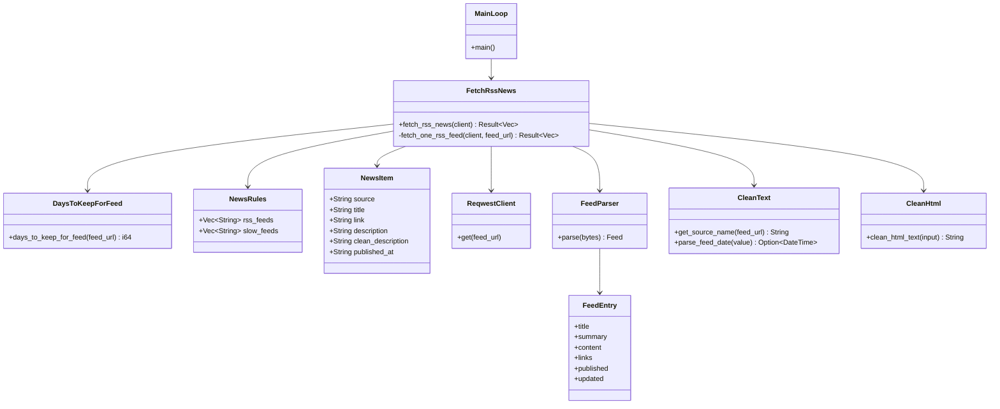
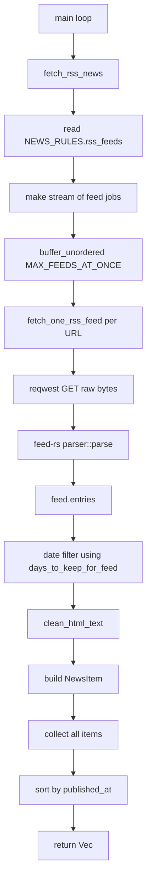
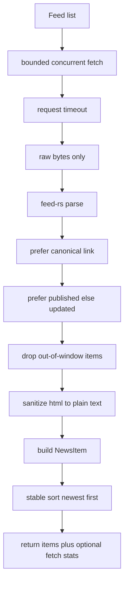
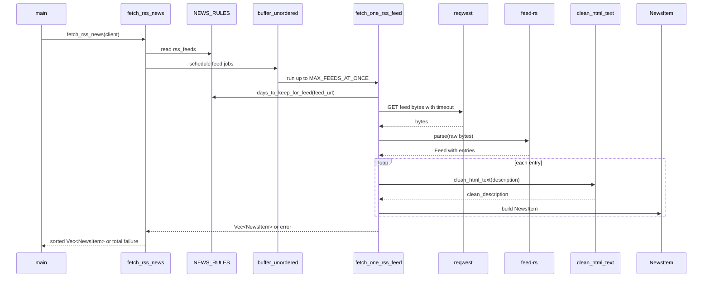

# Fetching RSS

This folder is the fetch layer of the app.

It does one job:

- download feeds
- parse feed entries
- filter by time window
- map entries into `NewsItem`

That is the correct responsibility boundary.
It does not:

- dedupe by day
- group same story
- pick what goes to the AI
- write the final Telegram post

This review was made in two layers:

- local code review of every file in `src/fetching_rss`
- current docs review for `feed-rs`, `futures` stream buffering, `reqwest`, and `chrono`

## Current files

- [mod.rs](./mod.rs)
- [days_to_keep_for_feed.rs](./days_to_keep_for_feed.rs)
- [fetch_rss_news.rs](./fetch_rss_news.rs)
- [fetching_rss.md](./fetching_rss.md)

This file is the new, up-to-date review:

- [feching_rss.md](./feching_rss.md)

## Folder role in the app

The real path is:

1. `main.rs` calls `fetch_rss_news(&client)`
2. this folder reads `NEWS_RULES.rss_feeds`
3. it fetches feeds concurrently
4. it parses them with `feed-rs`
5. it filters entries by date window
6. it builds `NewsItem`
7. it sorts items by newest date
8. it returns one flat `Vec<NewsItem>`

After that, other folders take over:

- `reading_news_today`
- `reading_stories_today`
- `grouping_news`
- `picking_news`
- `writing_news`

## Class diagram



## Flow diagram

### Current flow in this project



### Best flow if we want the strongest fetch layer



## UML sequence diagram



## File by file review

| File | What it does | Used now? | Notes |
| --- | --- | --- | --- |
| [mod.rs](./mod.rs) | exports the fetch submodules | Yes | Small and correct |
| [days_to_keep_for_feed.rs](./days_to_keep_for_feed.rs) | decides the date window for each feed | Yes | Very simple and useful, but hardcoded in behavior |
| [fetch_rss_news.rs](./fetch_rss_news.rs) | fetches, parses, filters, maps, and sorts news | Yes | Core runtime file; mostly good |
| [fetching_rss.md](./fetching_rss.md) | older documentation file | No runtime use | Outdated; still describes `join_all` and old file names |

## What each file does well today

### [fetch_rss_news.rs](./fetch_rss_news.rs)

This is the core file.

Good today:

- bounded concurrency with `buffer_unordered(MAX_FEEDS_AT_ONCE)`
- per-request timeout with `RequestBuilder::timeout`
- raw bytes passed into `feed-rs`
- one flat `Vec<NewsItem>` returned
- partial failure tolerance
- total failure only when every feed fails

That is a strong fetch design for this app.

### [days_to_keep_for_feed.rs](./days_to_keep_for_feed.rs)

Good today:

- simple rule
- easy to understand
- avoids treating low-frequency technical blogs like spammy high-volume feeds

That logic fits the editorial shape of the app.

### [mod.rs](./mod.rs)

Good today:

- exactly enough

No change needed.

### [fetching_rss.md](./fetching_rss.md)

This file is now stale.

Main mismatches:

- talks about `join_all`, but the code now uses `buffer_unordered`
- talks about old file names like `read_feeds.rs` and `feed_days.rs`
- describes code that no longer matches the current folder layout

It should not be treated as current documentation anymore.

## Current runtime behavior

### `fetch_rss_news`

Current behavior in [fetch_rss_news.rs](./fetch_rss_news.rs):

1. read `NEWS_RULES.rss_feeds`
2. clone each feed URL into a stream of async jobs
3. run up to `MAX_FEEDS_AT_ONCE = 10` jobs at once
4. collect all results
5. keep only successful feed results
6. merge all `NewsItem`s
7. fail only if every feed fails
8. sort newest first using `parse_feed_date(&item.published_at)`

This is good because:

- it is fast
- it is resilient to partial provider failure
- it keeps the fetch layer independent from later editorial logic

### `fetch_one_rss_feed`

Current behavior:

1. derive `source` from feed URL
2. derive `keep_days` from `days_to_keep_for_feed`
3. fetch raw bytes
4. parse with `feed-rs`
5. compute:
   - `today`
   - `start_day`
6. walk through feed entries
7. keep only entries inside the local day window
8. map each entry into `NewsItem`

That is pragmatic and mostly correct.

### `days_to_keep_for_feed`

Current behavior:

- if the feed URL contains a `slow_feeds` match -> keep `14` days
- otherwise -> keep `1` day

This is a simple heuristic.
It works because the project has a clear editorial bias:

- frequent retail feeds should stay short-window
- slower technical feeds deserve longer lookback

## Current gaps and tradeoffs

### 1. Error handling is intentionally partial, but silent

Current behavior:

- failed feeds are ignored
- success count is tracked
- detailed per-feed error is discarded

This is good for robustness.
But the downside is:

- you cannot see which feed failed
- you cannot see how often a specific feed fails
- you cannot see parse failure vs timeout vs bad status

Best stronger shape:

- keep partial success behavior
- also collect per-feed errors for logging or metrics

### 2. Sorting reparses the date every time

Current sort:

```rust
items.sort_by_cached_key(|item| std::cmp::Reverse(parse_feed_date(&item.published_at)));
```

This is already better than reparsing on every comparison.
So the current code is not bad.

But it still means:

- date parsing happens after item construction
- parse result is not stored inside `NewsItem`

For this app, acceptable.
For a heavier pipeline, a timestamp field would be stronger.

### 3. Link picking is good, but not the strongest rule

Current logic:

- first link where `rel != "self"`

That avoids obvious self links.
But the stronger canonical rule would be:

1. prefer `rel == "alternate"`
2. else prefer first non-`self`
3. else fallback to first link

This matters because some feeds publish:

- self
- alternate
- enclosure
- media links

### 4. Date filtering is local-time policy, not universal truth

Current logic:

- take entry `published` or `updated`
- convert to `Local`
- compare to `today` and `start_day`

That is good for a bot running on one editorial timezone.
But it can produce edge cases around midnight if the feed timezone is very different.

This is not wrong.
It is just an app policy.

### 5. `days_to_keep_for_feed` is simple, but rigid

Today the rule is binary:

- `14`
- `1`

That is easy to understand.
But it is less expressive than:

- per-feed explicit day counts

For example, one day may be too short for some feeds and fourteen too long for others.

### 6. No HTTP status check before body read

Current code:

- sends request
- reads bytes
- parse attempt happens later

There is no explicit:

- `.error_for_status()`

That means 404 pages, rate-limit HTML, or CDN error pages may flow into the parser and show up as parse errors instead of HTTP errors.

Best stronger shape:

- call `.error_for_status()?` after `.send().await?`

### 7. No conditional HTTP fetch

Current code always does:

- fresh GET

No use of:

- `ETag`
- `If-None-Match`
- `Last-Modified`
- `If-Modified-Since`

This is okay for the current scale.
But it means:

- repeated bandwidth
- repeated parse work
- no upstream caching cooperation

## Best practices from the current docs

These are the best-fit recommendations for this project.

### 1. Keep passing raw bytes to `feed-rs`

This is already correct.

The `feed-rs` parser docs explicitly warn:

- do not use pre-decoded `text()` if the XML encoding matters
- pass raw encoded content, such as reqwest `.bytes()`

The current code does exactly that:

```rust
.send()
.await?
.bytes()
.await?;
```

That is the right choice.

### 2. Keep using bounded concurrency instead of full fan-out

The `futures` docs say `buffer_unordered(n)` keeps at most `n` futures buffered at once and yields results in completion order.

That is a better fit than unbounded fan-out because:

- it limits network pressure
- it limits memory pressure
- it still preserves good throughput

For this app, `buffer_unordered(10)` is a reasonable design.

### 3. Keep per-request timeout

The `reqwest` docs say `RequestBuilder::timeout()` applies from connection start until the response body has finished.

That is exactly the right protection for feed fetches.

Feeds are remote and unreliable.
Timeouts must stay close to the request layer.

### 4. Keep `feed-rs` as the default parser for now

`feed-rs` docs show:

- Atom
- RSS
- JSON Feed

through one normalized model.

That matches the project well.

The crate also documents:

- lenient parsing
- automatic format detection
- low-copy behavior
- use of `quick-xml`

For this app, that is a very good default.

### 5. `feedparser-rs` is a real benchmark alternative, but not an automatic replacement

The `feedparser-rs` docs claim:

- high-performance parsing
- `200+ MB/s throughput`
- tolerant parsing
- HTTP support

That makes it a legitimate future benchmark candidate.

But the current best decision is still:

- keep `feed-rs`
- benchmark only if parsing becomes a proven bottleneck

Why:

- the current code already fits `feed-rs`
- HTTP and LLM time are probably much larger than parse time
- `feed-rs` unified model already fits the rest of the pipeline

### 6. Keep timezone-aware date logic

The `chrono` docs emphasize timezone-aware `DateTime` types and note that operations that may fail return `Option` or similar safe types.

That matches the current parsing style:

- parse with timezone
- convert to `Local`
- compare by local date

This is the correct safe direction.

## Best of the best way to use this folder

If we want the strongest design without making it too heavy, this is the best path.

### Keep as is

Keep:

- one fetch orchestrator function
- one per-feed worker
- one simple day-window helper
- raw bytes into parser
- bounded concurrency
- timeout per feed
- partial success behavior

These are good design choices.

### Improve next

The best next improvements would be:

1. Add `.error_for_status()?`
2. Log per-feed errors with feed URL
3. Prefer `rel == "alternate"` for the canonical link
4. Make day-window policy configurable per feed instead of only `1` or `14`
5. Optionally track fetch stats:
   - total feeds
   - good feeds
   - failed feeds
   - total items
6. Consider conditional requests later:
   - `ETag`
   - `Last-Modified`

### What I would not do now

I would not:

- move parsing into later folders
- return raw `feed_rs::model::Entry` outside this folder
- replace everything with a heavy feed SDK
- make fetch fully sequential

That would make the app worse.

## Best fetch shape for this app

If I were describing the ideal fetch rule, it would be this:

```text
1. read feed URLs from NEWS_RULES
2. run bounded concurrent HTTP GET
3. fail fast on HTTP status errors
4. parse raw bytes with feed-rs
5. keep only entries with published or updated date
6. filter by local day window
7. choose canonical link
8. choose summary or content.body
9. sanitize to plain text
10. build NewsItem
11. sort newest first
12. return flat Vec<NewsItem>
```

That is very close to the current implementation.

## Compare with similar approaches

### Current fetch design vs sequential loop

Sequential loop:

- simpler
- but much slower
- one slow feed blocks all later feeds

Current bounded concurrent design:

- still simple
- much faster
- safer than unbounded parallel fetch

Current design wins.

### `buffer_unordered` vs `join_all`

The old doc in this folder still talks about `join_all`.

But `buffer_unordered` is a better fit here because:

- it enforces a concurrency limit
- it yields by completion order
- it avoids spawning or holding every future at once

For feed IO, that is the stronger design.

### `feed-rs` vs `rss`

`feed-rs` is better because:

- it supports Atom, RSS, and JSON Feed
- it exposes one normalized model
- it already matches the app's current mapping logic

### `feed-rs` vs `feedparser-rs`

`feedparser-rs` looks promising on raw parser speed.
But the best current decision is still to keep `feed-rs` until a real benchmark on this app says otherwise.

## File by file recommendations

### [fetch_rss_news.rs](./fetch_rss_news.rs)

Good today:

- best file in the folder
- strong overall structure
- good concurrency choice

Best next improvements:

- `error_for_status()`
- better canonical link selection
- per-feed error logging

### [days_to_keep_for_feed.rs](./days_to_keep_for_feed.rs)

Good today:

- tiny
- readable
- matches editorial intent

Best next improvements:

- allow per-feed explicit days in config
- maybe rename rule source in YAML from `slow_feeds` to something that reflects the real meaning better, if you ever revisit naming

### [mod.rs](./mod.rs)

Good today:

- exactly enough

No change needed.

### [fetching_rss.md](./fetching_rss.md)

Needs replacement.

It no longer describes the real code.

## Sources

Primary sources used for this review:

- `feed-rs` crate docs: https://docs.rs/feed-rs
- `feed-rs` parser docs: https://docs.rs/feed-rs/latest/feed_rs/parser/struct.Parser.html
- `feed-rs` parse docs: https://docs.rs/feed-rs/latest/feed_rs/parser/fn.parse.html
- `futures` `buffer_unordered` docs: https://docs.rs/futures-util/latest/futures_util/stream/trait.StreamExt.html#method.buffer_unordered
- `reqwest::RequestBuilder::timeout` docs: https://docs.rs/reqwest/latest/reqwest/struct.RequestBuilder.html#method.timeout
- `chrono` crate docs: https://docs.rs/chrono/latest/chrono/
- `feedparser-rs` crate docs: https://docs.rs/feedparser-rs/latest

## Final verdict

The fetch layer is in good shape.

The most important design choices are already correct:

- raw bytes into `feed-rs`
- bounded concurrency
- per-request timeout
- mapping early into `NewsItem`

The biggest things missing are operational polish:

- explicit HTTP status handling
- per-feed error visibility
- slightly stronger canonical link selection

So the next move here is not a rewrite.
It is a small hardening pass on the current fetch path.
